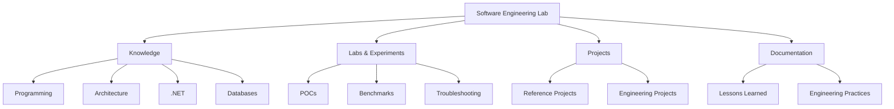

# Software Engineering Lab



## swe-lab life cycle follows:

```text
Understand → Design → Build → Experiment → Validate → Document → Improve
      ↑                                                        ↓
      └────────────────────────────────────────────────────────┘
```

> A practical knowledge base of software engineering concepts, experiments, reference implementations, and technical notes.

Welcome to my **Software Engineering Lab**.

This repository is my continuously evolving engineering notebook — a place to learn, experiment, implement, document, and revisit concepts across software development and modern engineering practices.

It combines **theory with working code**, with an emphasis on understanding not only *how* something works, but also **why it exists, when to use it, and what trade-offs it introduces**.

---

## 🧭 What You'll Find Here

The repository covers a broad range of software engineering topics:

| Area                   | Topics                                                                |
| ---------------------- | --------------------------------------------------------------------- |
| 💻 Programming         | C++, C#, Python, PowerShell, Bash                                     |
| 🏗️ Architecture       | Design Patterns, SOLID, Clean Architecture, DDD                       |
| ⚙️ .NET                | .NET, ASP.NET, WCF, Dependency Injection, Diagnostics                 |
| 🐳 DevOps              | Git, GitHub, CI/CD, Docker, Kubernetes                                |
| ☁️ Cloud               | Azure, AWS, GCP, Cloud Architecture                                   |
| 🗄️ Databases          | SQL Server, PostgreSQL, NoSQL, Redis                                  |
| 🧪 Testing             | Unit, Integration, API, Automation, Performance                       |
| 🔐 Security            | Authentication, Authorization, TLS, Certificates, Secure Coding       |
| 🌐 Networking          | TCP/IP, HTTP, DNS, Proxies, Troubleshooting                           |
| 🐧 Operating Systems   | Linux, Windows, Virtualization                                        |
| 🧠 Algorithms          | Data Structures, Algorithms, Concurrency, Performance                 |
| 🔭 Distributed Systems | Messaging, Caching, Consistency, Resilience                           |
| 📊 Observability       | Logging, Metrics, Tracing, Diagnostics                                |
| 🛠️ Tools              | Visual Studio, VS Code, VirtualBox, Chocolatey, ProGet                |
| 🔬 Labs                | Experiments, prototypes, proof-of-concepts, reference implementations |

---

## 📚 Repository Map

```text
software-engineering-lab/
│
├── programming/              # Programming languages and fundamentals
├── dotnet/                   # .NET ecosystem
├── architecture/             # Architecture and design
├── databases/                # Data and database engineering
├── devops/                   # DevOps, CI/CD and delivery
├── cloud/                    # Cloud platforms and architecture
├── operating-systems/        # Linux, Windows and virtualization
├── networking/               # Networking and communication
├── security/                 # Application and infrastructure security
├── testing/                  # Testing and automation
├── algorithms/               # Algorithms and computer science
├── distributed-systems/      # Distributed computing concepts
├── tools/                    # Developer and engineering tools
├── projects/                 # Larger examples and prototypes
├── labs/                     # Hands-on experiments
└── docs/                     # Cross-cutting documentation
```

---

## 🎯 Learning Philosophy

This repository follows a simple principle:

> **Understand → Implement → Experiment → Document → Revisit**

A technology is easier to understand when theory is accompanied by a working example.

For each important topic, I aim to capture:

* **What** it is
* **Why** it exists
* **How** it works
* **When** to use it
* **When not** to use it
* Common implementation approaches
* Design trade-offs
* Failure modes and troubleshooting techniques
* Practical examples
* Related concepts

The goal is not to collect code snippets.

The goal is to build **engineering intuition**.

---

## 🏗️ Architecture & Design

Architecture is one of the major areas of this repository.

Topics include:

* SOLID principles
* Clean Code
* Refactoring
* Design Patterns
* Clean Architecture
* Hexagonal Architecture
* Domain-Driven Design
* Microservices
* Event-Driven Architecture
* Distributed Systems
* System Design
* Resilience and Fault Tolerance
* Scalability
* Observability

---

## 💻 Programming

Languages and programming concepts currently explored include:

* C++
* C#
* Python
* PowerShell
* Bash

The focus is on practical implementation as well as fundamental concepts such as:

* Object-oriented programming
* Functional programming concepts
* Memory management
* Concurrency
* Multithreading
* Asynchronous programming
* Error handling
* Performance
* Data structures
* Algorithms

---

## ⚙️ .NET

The .NET section contains experiments and reference implementations around:

* Modern .NET
* C#
* ASP.NET
* WCF
* Dependency Injection
* Configuration
* Logging
* Serialization
* Networking
* Performance
* Diagnostics
* Application architecture

---

## 🐳 DevOps & Delivery

Engineering doesn't end when the code compiles.

This repository also explores the systems used to build, package, test, release and operate software:

* Git
* GitHub
* CI/CD
* Docker
* Kubernetes
* Package management
* Artifact repositories
* Infrastructure as Code
* Automation
* Release engineering
* Observability

---

## 🧪 Testing & Quality

Testing topics include:

* Unit Testing
* Integration Testing
* API Testing
* Contract Testing
* UI Testing
* Test Automation
* Performance Testing
* Test Design
* Testability
* Mocking
* Test Doubles
* CI test pipelines

The objective is to understand testing as an **engineering discipline**, rather than simply achieving code coverage.

---

## 🔐 Security

Security is treated as a cross-cutting engineering concern.

Topics include:

* Authentication
* Authorization
* Identity
* OAuth
* TLS
* Certificates
* Secrets Management
* Secure Coding
* Application Security
* Dependency Security
* Security in CI/CD

**No credentials, tokens, private keys, production configuration or sensitive information should ever be committed to this repository.**

---

## 🔬 Labs & Experiments

The `labs/` directory contains hands-on experiments and proof-of-concepts.

These may include:

* Technology evaluations
* Performance experiments
* Architecture prototypes
* Networking experiments
* Container experiments
* Automation scripts
* Troubleshooting reproductions
* Minimal reproducible examples

Labs are intentionally practical and may evolve or be replaced as understanding improves.

---

## 🧠 Engineering Notes

The `docs/` directory contains concepts that cut across multiple technologies.

Examples:

```text
docs/
├── architecture/
├── engineering-principles/
├── learning-paths/
├── troubleshooting/
├── cheat-sheets/
└── glossary/
```

This is where I capture lessons that are broader than a particular programming language or framework.

---

## 🗺️ Suggested Learning Paths

### Software Engineering Fundamentals

```text
Programming Fundamentals
        ↓
Data Structures & Algorithms
        ↓
Object-Oriented Design
        ↓
SOLID
        ↓
Design Patterns
        ↓
Clean Code & Refactoring
        ↓
Software Architecture
```

### Backend Engineering

```text
Programming
    ↓
.NET / Python / C++
    ↓
HTTP & Networking
    ↓
Databases
    ↓
API Design
    ↓
Testing
    ↓
Caching & Messaging
    ↓
Distributed Systems
```

### DevOps Engineering

```text
Git
 ↓
Build Systems
 ↓
Package Management
 ↓
CI/CD
 ↓
Containers
 ↓
Infrastructure as Code
 ↓
Cloud
 ↓
Observability
```

---

## 🛠️ How to Use This Repository

This repository is intended to be useful in several ways:

### Learn

Read the documentation and follow the examples.

### Experiment

Clone a lab and modify it.

### Compare

Look at different implementations of the same concept.

### Revisit

Use the repository as a personal engineering reference.

### Build

Use the examples as starting points for larger projects.

---

## 📌 Repository Principles

A few principles guide the content:

1. **Prefer understanding over memorization.**
2. **Prefer simple solutions over unnecessary complexity.**
3. **Document the reasoning behind important decisions.**
4. **Show trade-offs, not just the preferred solution.**
5. **Keep examples small and focused.**
6. **Automate repetitive tasks where practical.**
7. **Treat security as part of engineering, not an afterthought.**
8. **Measure performance rather than assuming it.**
9. **Test behavior, not implementation details.**
10. **Continuously revisit and improve previous work.**

---

## 🚧 Status

This is a **living repository**.

New technologies, experiments, notes and implementations will be added over time.

Some examples are intentionally small and educational rather than production-ready. Production systems require additional considerations such as security, resilience, observability, deployment strategy, operational support and compliance.

---

## 🤝 Contributions

This repository is primarily a personal engineering knowledge base, but ideas, corrections, discussions and improvements are welcome.

If you spot an error or have a better approach, feel free to open an issue or pull request.

---

## 📖 Further Reading

Where appropriate, individual topics contain links to official documentation, specifications, books, papers and other authoritative resources.

The intention is to use this repository as a **map for learning**, rather than attempting to reproduce external documentation.

---

## 👤 About

**Cyril Vimal**

Software engineering enthusiast focused on building practical knowledge across programming, architecture, systems, automation, DevOps and modern software engineering practices.

GitHub: [@cyrilvimal](https://github.com/cyrilvimal)

---

> **Learn deeply. Build practically. Understand the trade-offs.**
